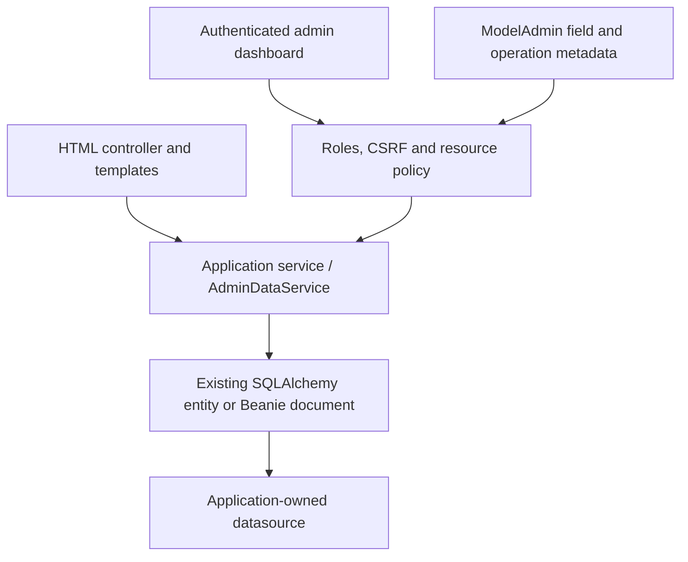

# Native web applications and model administration

PyFly renders HTML on both its Starlette and FastAPI adapters. Web pages, REST endpoints,
and model administration share the application's existing SQLAlchemy entities or Beanie
documents. `ModelAdmin` adds exposure and policy metadata; it does not define another model
or migrate the database.

Install `pyfly[webapp]` for Starlette, templates, and browser security. Add
`data-relational` or `data-document` for the corresponding administration provider.
FastAPI applications add the `fastapi` extra. Existing REST-only installations need no
new dependency. Template rendering is opt-in.

Only `pyfly new my-site --archetype web` enables browser features automatically.
`web-api`, `fastapi-api`, `core`, `hexagonal`, `library`, and `cli` projects keep them
disabled. Installing the `webapp` extra alone does not enable a welcome page, templates,
static routes, or HTML errors. An existing API can deliberately opt in using the
configuration below; its REST controllers continue returning JSON errors.

## How the pieces fit



A persistence model defines stored data. A Pydantic input model validates submitted
values. `ModelAdmin` defines which existing model fields and operations administrators
may use. These are separate responsibilities over the **same persisted records**.
The catalog shares its `ProductWrite` validation and `AdminDataService` between native
forms and the dashboard; public applications can keep their existing business services.

Start with a read-only registration, confirm its visible fields and permissions, then
explicitly add writes. Model administration does not discover and expose every table.
See the [configuration defaults](configuration.md#native-webapp-defaults) and
[model-admin defaults](configuration.md#model-administration-defaults) for every property.

## HTML views

```python
from pyfly.container import controller
from pyfly.web import ModelAndView, Redirect, get_mapping

@controller
class Pages:
    @get_mapping("/", name="home")
    async def home(self) -> ModelAndView:
        return ModelAndView("home.html", {"title": "Catalog"})

    @get_mapping("/start")
    async def start(self) -> Redirect:
        return Redirect("/")
```

```yaml
pyfly:
  web:
    templates:
      enabled: true
      directories: [templates]
      packages: []                  # e.g. ["myapp:templates"]
      strict-undefined: true
      auto-reload: false
      cache-size: 400
    static:
      enabled: true
      path: /static
      directories: [static]
      packages: []                  # e.g. ["myapp:static"]
      cache-control: no-cache
    errors:
      html-enabled: true
      templates: {"404": errors/not-found.html}
      default-template: errors/error.html
```

Filesystem roots are relative to the working directory and must exist. Package roots are
relative to an installed Python package; use `directories: []` when using packages alone.
Filesystem roots take precedence over package roots. Templates support Jinja inheritance,
includes, async helpers, and HTML autoescaping. Keep application templates trusted: this
is an application template engine, not a sandbox for user-authored templates. Static
mounts reject overlapping controller paths and do not follow symlinks outside their roots.

`ModelAndView` accepts optional `status_code` and `headers`; a view's explicit status
wins over the mapping's status. `Redirect` defaults to 303 and accepts a local absolute
path. External HTTP(S) destinations require `allow_external=True`. Raw ASGI responses,
JSON controller results, and response converters retain their existing behavior.

Templates receive `url_for`, `reverse`, `static_url`, `csrf_token`, and `csrf_field`. Route names must be unique;
when omitted, names use the controller's module, qualified class name, and method name.
Use explicit names and the helpers below for links that work under an ASGI mount prefix.

Register a bean implementing `TemplateEngine.render(template, context)` to replace Jinja.
Register `TemplateContextProcessor` beans with async `get_context(request)` to add
request-specific values. Each render builds a new context; the view's model overrides
processor values and the framework reserves its URL/CSRF helpers. Do not mutate an
engine's global state with request data.

## Branded welcome page

With templates enabled, PyFly serves a welcome page at `/` if the application has no
home route. Application controllers, including beans discovered at startup, take
precedence. `pyfly.web.welcome.enabled: false` disables the fallback. Its default
template is `pyfly/welcome.html`; set `welcome.template` to select your own page.
For a minimal webapp using only bundled templates, set `templates.enabled: true`
and `templates.directories: []`. No application static directory is required.

The page uses the PyFly logo and green palette, adapts to the browser's light/dark
preference, and supports mobile layouts. Normal views and errors share `branding`,
`home_url`, and `web_asset_url(filename)` context values. Branding is configured once:

```yaml
pyfly:
  web:
    branding:
      name: Catalog
      tagline: Your products, beautifully organized.
      logo-url: /static/catalog-logo.svg
      favicon-url: /static/favicon.svg
      primary-color: "#4cbb2f"
      accent-color: "#c2e85f"
      documentation-url: https://example.com/catalog/guide
      support-url: https://example.com/catalog/support
      footer: Catalog · Built with PyFly
      assets-path: /_pyfly/web
    welcome:
      enabled: true
      template: pages/welcome.html
```

Logo/favicon URLs can be application-relative paths (the mount/root prefix is added)
or HTTP(S) URLs. Empty `logo-url` uses the packaged PyFly logo; an empty favicon omits
the icon link. Empty documentation/support URLs hide those links. Colors must be
six-digit hex values. The complete [configuration table](configuration.md#native-webapp-defaults)
lists defaults. Use an appropriate content-security policy for external logos.

Customize a page without copying the framework layout:

```html
<!-- templates/pages/welcome.html -->

Welcome to the catalog

  <a href="{{ reverse('products') }}">Products</a>
  {{ super() }}

```

`pyfly/base.html` supplies `title`, `head`, `navigation`, `content`, and `footer`
blocks; `pyfly/welcome.html` and `pyfly/error.html` extend it. Override `error_heading`
and `error_message` in `pyfly/error.html` to customize error text while preserving
the diagnostic panel. Application loader roots
precede bundled templates. For complete replacement, place a same-named template in
an application root; do not have that file extend itself. A custom `TemplateEngine`
must provide the selected welcome template or disable the welcome fallback.

Bundled logo/CSS assets are served under `branding.assets-path` only when templates
or HTML errors are explicitly enabled. Reserve that prefix and permit it through
application security rules when login/error pages must load before authentication.
`web_asset_url('web.css')`, `web_asset_url('theme.css')`, and
`web_asset_url('logo.png')` preserve mounted prefixes. Ordinary application assets
continue using `static_url`. Styles are external, so the built-in pages work with
`style-src 'self'` and need no inline scripts or styles.

## Reference routes, static files, and template fragments

Name endpoints with the existing mapping decorators; no extra registration is needed:

```python
from starlette.requests import Request
from pyfly.container import controller
from pyfly.web import (
    ModelAndView, PathVar, Redirect, get_mapping, reverse, static_url,
)

@controller
class ProductPages:
    @get_mapping("/products/{id}", name="product_detail")
    async def detail(self, request: Request, id: PathVar[str]) -> ModelAndView:
        return ModelAndView("products/detail.html", {
            "product_id": id,
            "manual_url": static_url(request, "downloads/manual.pdf"),
        })

    @get_mapping("/featured")
    async def featured(self, request: Request) -> Redirect:
        return Redirect(reverse(request, "product_detail", id="featured"))
```

Within any native page template, the request is already bound:

```html
<link rel="stylesheet" href="{{ static_url('css/app.css') }}">
<script defer src="{{ static_url('js/app.js') }}"></script>

<a href="{{ static_url('downloads/manual.pdf') }}">Download the manual</a>
<a href="{{ reverse('product_detail', id=product_id) }}">Product</a>

```

| Purpose | In Python | In a template |
|---|---|---|
| Local named route | `reverse(request, "home")` | `reverse('home')` |
| Named route with parameters | `reverse(request, "product_detail", id="42")` | `reverse('product_detail', id='42')` |
| Configured public asset | `static_url(request, "css/app.css")` | `static_url('css/app.css')` |
| Absolute route URL | `request.url_for("home")` | `url_for('home')` |
| Include another template | Render a `ModelAndView` | `` |

`reverse` and `static_url` return URL-encoded local paths, suitable for `Redirect`
and HTML attributes. Pass **decoded** names and values: `files/café #1.pdf` becomes
`files/caf%C3%A9%20%231.pdf`. Do not pre-encode input or append a query string to an
asset filename. If the app is mounted at `/shop`, behind ASGI root path `/portal`,
with `pyfly.web.static.path: /assets`, `static_url('css/app.css')` returns
`/portal/shop/assets/css/app.css`. Configure the ASGI server/proxy root path to match
the deployment; helpers do not infer it from arbitrary forwarded headers.

Asset paths are relative to the configured static roots. Leading slashes, backslashes,
control characters, and `.`/`..` path segments are rejected. URL generation does not
check that a file exists; requesting a missing asset returns 404. An unknown route,
wrong route parameters, or disabled static mount raises the router's `NoMatchFound`
error instead of inventing a URL. Helpers require an active application request;
background jobs should receive their public origin/prefix through application config.

Static URLs refer to **public files** under configured roots, not arbitrary local
files or protected uploads. Keep templates and secrets outside those roots. Jinja
`extends` and `include` use names relative to the template loader roots; they do not
publish files. For packaged non-public data in Python, use `importlib.resources.files`
and pass the loaded values to the view. Serve protected downloads through an authorized
controller, then link to its named route with `reverse`.

## HTML forms and CSRF

```python
from pydantic import BaseModel, Field
from pyfly.web import Form, ModelAndView, exception_handler, post_mapping
from pyfly.web.forms import FormValidationException

class ContactForm(BaseModel):
    name: str = Field(min_length=1, max_length=80)
    subscribed: bool = False
    tags: list[str] = []

# Methods inside an @controller:
@post_mapping("/contact")
async def save(self, contact: Form[ContactForm]) -> ModelAndView:
    return ModelAndView("saved.html", {"contact": contact})

@exception_handler(FormValidationException)
async def invalid(self, error: FormValidationException) -> ModelAndView:
    return ModelAndView("contact.html", {"values": error.values, "errors": error.errors}, status_code=422)
```

Every unsafe browser form includes:

```html
<input type="hidden" name="{{ csrf_field }}" value="{{ csrf_token }}">
```

The same CSRF token remains valid across GETs and normal submissions, allowing multiple
open tabs. Session rotation or invalidation rotates the CSRF cookie. Existing cookie/header protection also accepts the hidden form field.
The secure cookie default requires HTTPS; for local HTTP development set
`pyfly.security.csrf.cookie-secure: false`. Keep CSRF enabled for browser applications.
Admin mutations independently require both the CSRF cookie and matching header, including
when using a bearer credential; a bearer-shaped string never authorizes administration.

`Form[T]` supports scalar values and Pydantic models, field aliases, repeated list fields,
and multipart text fields alongside `File[UploadedFile]`. Repeated scalar fields are
rejected. An unchecked checkbox is absent, so give its Boolean field a default of `False`.
Use `value="true"` on Boolean checkboxes. Password/secret/token/CSRF fields and secret
Pydantic types are omitted from validation redisplay values; error messages contain no
submitted input. Render errors and values through escaping templates.

Configure `pyfly.web.forms.max-fields` (1000), `max-files` (20), `max-part-size` (1 MiB),
and `max-body-size` (16 MiB). Parsing is shared by CSRF, form, and file binding. Oversized
requests fail before controller execution, and multipart temporary files are closed after
the request. `Body[T]` retains JSON binding.

## HTML errors

When enabled and HTML is preferred, error resolution tries the explicit status mapping,
`errors/<status>.html`, `errors/<family>xx.html`, then `default-template`. Missing templates
advance to the next candidate. A broken error template produces an escaped built-in page
without recursively invoking the failed template. Error context contains `status`, `title`,
`message`, `path`, and `transaction_id`, plus `reverse`, `static_url`, and `url_for`
for navigation and shared assets. Error rendering skips application context processors
and CSRF/form helpers so it does not depend on a failed page's context. Server errors
keep a generic public message. The fallback shares the PyFly branding and uses an
independent bundled loader if an application template fails. A minimal escaped branded
fallback also works when Jinja is not installed.

### Stack traces and development diagnostics

`pyfly.web.errors.include-stacktrace` defaults to `on-debug`. Set `pyfly.web.debug: true`
(or pass `debug=True` to the adapter factory) for development diagnostics. Use `never`
to suppress them even during debugging, or explicitly select `always` to show them
regardless of debug mode. Query parameters cannot enable traces. With HTML errors
enabled, PyFly handles debug rendering instead of Starlette's generic debug page;
REST controller errors still remain JSON.

Custom error templates receive these additional values:

| Value | Meaning |
|---|---|
| `show_stacktrace` | Whether diagnostics are enabled and an exception is available. |
| `exception_type`, `exception_message` | Original exception details; empty when diagnostics are disabled. |
| `stack_trace` | Escaped when rendered by Jinja; formatted trace of the original exception. |
| `stack_frames` | Ordered frame mappings with `filename`, `lineno`, `function`, and `source`; empty when disabled. |

The original exception is retained even if an exception converter translates it to
a different HTTP status. `max-stack-frames` defaults to 30 (range 1–200) and
`max-trace-length` to 20,000 characters (range 256–100,000). Only the most recent frames
of the current exception are included, not chained exceptions or local variables.
No request headers, cookies, query parameters, or body are collected. Exception text
and source lines can still contain sensitive data: leave diagnostics off on public
production deployments. Keep autoescaping enabled; do not apply `safe` to a trace.

The catalog custom error templates inherit the branded layout and trace panel:

```html


  <a href="{{ reverse('catalog') }}">Catalog</a>
  {{ super() }}

```

For a fully independent error layout, display diagnostics explicitly with
`<pre>{{ stack_trace }}</pre>`. Early security
rejections may have no exception, in which case no trace is available.

REST controller errors remain JSON. Routing errors negotiate from `Accept`, including
quality values and explicit `text/html;q=0`. HTML pages can use HTML errors with `*/*`.
Authentication/CSRF rejections also negotiate HTML without changing their status or
security headers. Error pages use `Cache-Control: no-store` and `Vary: Accept`.

## Register existing models

```python
from pyfly.admin import ModelAdmin
from pyfly.container import bean, configuration
from myapp.models import Product
from myapp.schemas import ProductWrite

@configuration
class Administration:
    @bean
    def products_admin(self) -> ModelAdmin:
        return ModelAdmin(
            "products", Product, label="Products", datasource="primary",
            fields=("id", "name", "price", "updated_at"),
            editable_fields=("name", "price"), search_fields=("name",),
            filter_fields=("name",), ordering=("name",),
            operations=("list", "read", "create", "update", "delete"),
            create_schema=ProductWrite, update_schema=ProductWrite,
        )
```

```yaml
pyfly:
  admin:
    enabled: true
    path: /admin
    data:
      enabled: true
      allowed-roles: [ADMIN]
      page-size: 25
      max-page-size: 100
      max-body-size: 1048576
      operations: [list, read, create, update, delete]
      edit-token-key: ${ADMIN_EDIT_TOKEN_KEY}
```

Use a randomly generated secret of at least 32 characters for the edit-token key and share
it across workers. Rotating it invalidates outstanding edits. Explicit registrations are
the complete exposure allowlist: unregistered tables, hidden columns, connection URLs,
and credentials are not exposed. No resources or data routes are enabled by default.
Read-only registrations need no edit-token key. Database credentials should also follow
least privilege; admin never creates tables or runs migrations.

`datasource="primary"` borrows the existing `async_session_factory` bean; a named source
borrows `NamedDataSources.get(name)`. `datasource="document"` uses the existing initialized
Beanie model and collection. Initialize document models through your existing repository
or application lifecycle. Admin never creates or closes an independent Mongo client.
You may also register an `AdminResourceRegistry` instance explicitly. User-supplied
`provider` objects take precedence over built-in selection. Borrowed providers are rebuilt
when the app's startup hooks rerun, without modifying your registrations or disposing
shared pools.

Authentication uses the existing PyFly security context. Configure JWT, HTTP Basic,
form-login/session security, or your existing identity provider; merely enabling the
admin UI does not authenticate anyone. The data API enforces `allowed-roles` even if the
monitoring dashboard has `require-auth: false`. With a separate management listener,
`pyfly.management.security.enabled: true` is required. Scope its existing HTTP security
rules to permit authenticated administrators at the configured management paths.

## Validation, authorization, and persistence

Visible and writable fields are explicit. Primary keys, audit/version fields, and binary
fields are read-only. SQLAlchemy preserves normal ORM validators, audit defaults/listeners,
versioning, transactions, and database constraints. Beanie validates the complete resulting
document and preserves BSON encoding and audit fields. Decimal values serialize as strings;
JSON values are JSON, not Python repr strings. Register `AdminFieldAdapter(type, serialize,
parse)` in `ModelAdmin.field_adapters` for application-specific field types. The parser must
return a model-compatible value; the serializer must return a JSON-compatible value.

Override `ModelAdmin.has_permission(operation, context, record=None)` for resource/object
policy. Override `scope(context)` with server-owned equality predicates for tenant/ownership
boundaries. Scope applies before list/count/detail/mutation queries; do not rely solely on
object hooks to hide list rows. Creates inherit scope values and updates cannot move a row
outside its scope. Backend validation rejects hidden/unknown keys and oversized/unallowlisted
queries even if a client bypasses the UI. Mutation audit logs record actor, resource,
identifier, submitted field names, and correlation ID without submitted field values.

SQLAlchemy supports scalar and composite keys, UUIDs, nullable values, decimal/date/time,
JSON, enums, and existing soft-delete/version mixins. Lists have stable key tie-breakers.
Writes use a new session and transaction. Updates/deletes lock rows before comparing the
opaque token against the full persisted snapshot (`FOR UPDATE` on PostgreSQL,
`BEGIN IMMEDIATE` on SQLite). A stale edit or conflicting constraint produces 409;
validation produces 422. Tests cover PostgreSQL and SQLite; other SQL dialects must provide
equivalent row-lock behavior before enabling concurrent administration writes.

MongoDB uses a single conditional replace/delete against the exact original BSON document.
This detects changed hidden fields, added fields, and missing/null distinctions. The built-in
provider does **not** execute arbitrary Beanie action hooks during conditional collection
writes. Applications requiring those hooks, service-level business invariants, or multi-model
transactions should supply a provider implementing `AdminDataProvider` and enforce those
invariants there. Custom providers must preserve scope, atomic stale-edit checks, and
validation; the service still applies roles, operation/field allowlists, and relation checks.

For scalar foreign keys, `relations={"category_id": "categories"}` selects a registered
resource. Choices use that resource's ordinary authorized paginated API. The service verifies
selected targets before mutations. Relationship graphs and nested writes are not inferred;
use a custom provider for those business operations.

## Dashboard and API

Enablement adds **Datasources** to the sidebar and command palette. The dashboard supports
resource selection, paging, literal search, sorting, configured equality filters, record
inspection, typed create/edit forms, relation selection, explicit nulls, JSON feedback,
record-named delete confirmation, and stale-edit errors. It preserves unsaved values on
errors and guards navigation away from changed forms. Hash state supports back/forward;
requests from abandoned views are canceled. Custom admin paths and mounted prefixes are
resolved from the served base URL.

The API is rooted at `<admin-path>/api/data`:

| Method | Path | Result |
| --- | --- | --- |
| GET | `/sources` | Authorized sources and resources |
| GET | `/resources/{resource}/schema` | Field metadata and allowed operations |
| GET | `/resources/{resource}/records` | `page`, `size`, `search`, `sort`, JSON `filters` |
| POST | `/resources/{resource}/records` | `{ "values": {...} }`; 201 record |
| GET | `/resources/{resource}/records/{id}` | Values and `edit_token` |
| PATCH | `/resources/{resource}/records/{id}` | `{ "values": {...}, "editToken": "..." }` |
| DELETE | `/resources/{resource}/records/{id}` | `If-Match: <edit_token>`; 204 |

Errors remain JSON on this API. The data subsystem cannot loosen the existing monitoring
security configuration. CSRF headers use `X-XSRF-TOKEN` and the `XSRF-TOKEN` cookie.

## Troubleshooting

| Symptom | Explanation and action |
|---|---|
| Missing template/static root on startup | Install the package or create the configured directory. Set `directories: []` for package-only resources. |
| HTML renders as an error | Check template names and undefined variables. Enable `auto-reload` in a development profile when editing templates. |
| Local POST returns 403 | Verify the hidden CSRF field or matching cookie/header, and disable secure cookies only for local HTTP. |
| Datasources is hidden | Enable `pyfly.admin.data.enabled`; the monitoring dashboard alone does not enable CRUD. |
| Datasources is empty | Verify registrations are discovered and the authenticated principal has the configured role and list permission. |
| Separate management listener fails to start | Enable management security and configure a real authentication mechanism for that listener. |
| Save returns 409 | Reload after a concurrent edit; check unique/database constraints. Do not retry an old token blindly. |
| Static links fail under a prefix | Use `static_url` and configure the ASGI root path instead of hardcoding `/static`. |
| Business side effects do not run | Built-in persistence does not call arbitrary application services or Beanie action hooks; supply a custom provider. |

## Run and migrate

See [the catalog sample](https://github.com/fireflyframework/fireflyframework-pyfly/tree/main/samples/webapp) for real HTML create/edit,
POST/redirect/GET, persistent SQLite, custom errors, and the same models in administration.
`pyfly new my-site --archetype web` now generates native `ModelAndView` controllers and
package-based template/static configuration. Existing applications can remove their manual
`Jinja2Templates` and `app.mount('/static', ...)` setup after enabling those properties.
Raw `TemplateResponse` remains supported for incremental migration; do not configure two
static mounts at the same path.

Run backend tests with `uv run pytest`. Run the new real-backend tests with
`PYFLY_INTEGRATION_REQUIRE_DOCKER=1 uv run pytest -m integration tests/integration/test_admin_data_postgres.py tests/integration/test_admin_data_mongo.py`.
For browser tests, install `uv sync --all-extras --no-extra pii --group dev --group browser`,
then `uv run playwright install chromium` and `uv run pytest -m browser tests/browser`.
